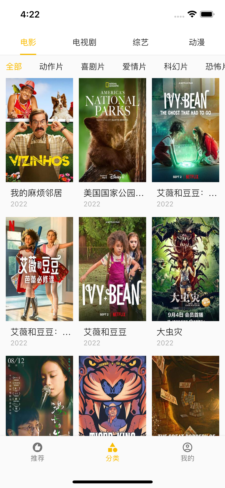

#  Flutter电影APP
> ***免费看电影***
一直在观望fluter都没有真正开发app，最近也是被各大视频平台的vip折磨，所以干脆开发了个不要钱的看电影APP

> 本代码只使用dio网络请求库，让自己更加了解flutter
## 开源不易，麻烦给个Star★吧(☺️右上角点击★Star，轻轻松松，一秒钟🤣)！

# 截图
## 首页 

## 分类

## 视频详情
